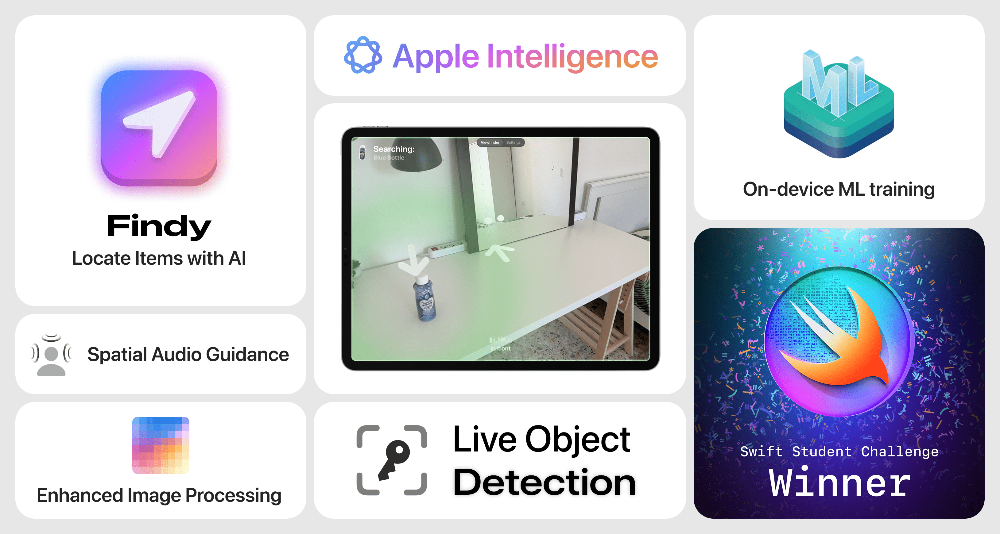

  
  

  
  <h2 align="center">
    Findy
  </h2>

            

Findy helps people with low vision to independently locate everyday items (like keys or TV remote) by training an on-device personalized AI model with photos of their belongings, and then guiding users with real-time voice directions and AR cues to the item’s real-time location through the device’s camera.

## Features

### Save and recognize objects  
Findy allows users to save objects by taking six photos, providing a comprehensive view for accurate recognition.

### On-device AI training  
Using Create ML, Findy trains a custom AI model entirely on the user’s device, ensuring privacy and personalization.

### Enhanced image processing  
The Vision framework improves image data by separating backgrounds, isolating objects, and generating relevant tags for better AI training.

### Live object detection  
With CoreML, Findy analyzes the live camera feed to identify saved objects in real time.

### 3D navigation assistance  
ARKit converts 2D object coordinates into 3D spatial data, and RealityKit renders an arrow pointing to the item’s location.

### Spatial audio guidance  
Using AVFoundation and RealityKit, Findy provides voice instructions and spatial audio cues to guide users toward their objects.

### AI-powered image enhancement  
Users can leverage Apple Intelligence via Image Playground to generate high-quality preview images of saved objects.

 

Findy incorporates accessibility features to assist our users, including support for VoiceOver.

## Requirements
- iOS 18.2+
- Xcode 16.0+

## Installation
1. Open Xcode.
2. Click on **"Clone Git Repository"**.
3. Paste the following URL: `https://github.com/matt-novoselov/Findy`
4. Click **"Clone"**.
5. Build and run the project in Xcode.

 

## Credits
Required attribution for YOLOv8:
- Author: Ultralytics
- License: GNU Affero General Public License v3.0 (AGPL-3.0)
- Copyright: © Ultralytics
- Source Code: https://github.com/ultralytics/ultralytics
- License Text: https://github.com/ultralytics/ultralytics/blob/main/LICENSE

For compliance, the full AGPL-3.0 license text along with the credits is included in the app’s legal section (settings).

 

Distributed under the MIT license. See **LICENSE** for more information.

Developed with ❤️ by Matt Novoselov
